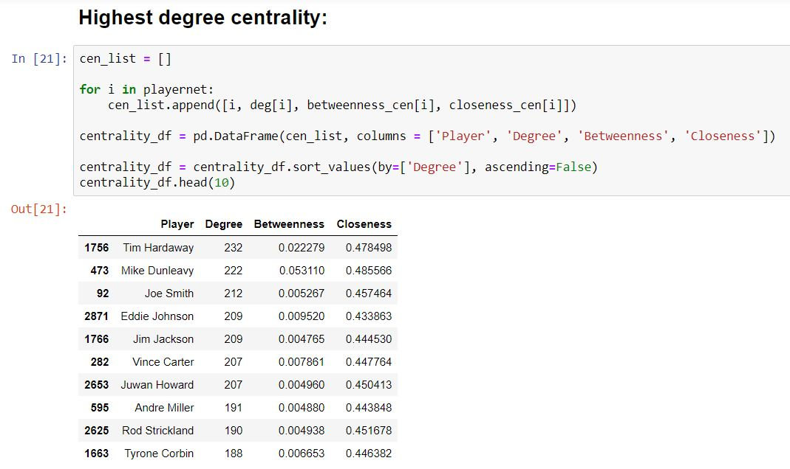
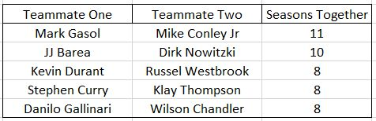

# NBA_Network_Analysis
 June, 2019
 Social Network Analysis of the NBA

## Project Overview:
Trades, short-term contracts, and large free agency classes cause today’s NBA players to move among teams frequently. On average, each current NBA player has played for 2.48 different teams and with 31.84 different teammates.

Thus, players have large networks of current and former teammates.

This project aims to describe and visualize interesting NBA teammate networks for active and former players. Active NBA teammate networks may be valuable to predict free agency moves and trade requests. Former NBA teammate networks are thought-provoking for NBA fans.

## About the Dataset:
This dataset includes information about NBA players by season from October, 1976 – July, 2019. This dataset excludes seasons for players that did not participate in at least 10 games during that season. Thus, this dataset also excludes connections between players that have not yet played together, such as Anthony Davis and LeBron James.

As noted below, this dataset is often broken into active players or all players (1976-present). An active player participated in at least 10 games during the 2018-2019 season.

## Data science tools used:
Python (language)
networkx (python library)
pandas (python library)
Social Network Analysis (mathematics concept)
2-mode network analysis (data science/math concept)

